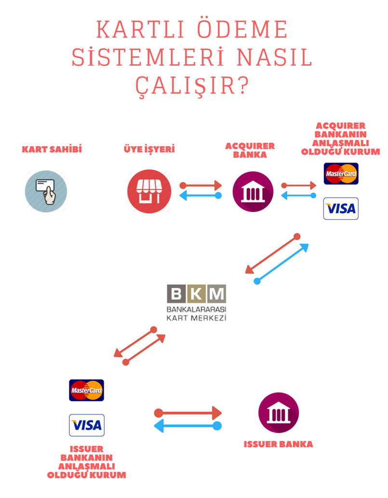

# VakıfBank SanalPos

Vakıfbank Sanalpos örnek php dosyası. 3d ve non3d işlem içerir. Vakıfbankın verdiği dökümantasyonu yetersiz bulduğum için hazırladım.

Production Serverda test edildi.

3d Otorizasyon aşamalarına şu resimden bakabilirsiniz.

Notlar:

* ÜİY: Üye iş Yeri
* MPI: Merchant Plugin 3d Eklentisi
* DS: Directory Server (Visa, MasterCard, Troy) 
* ACS: Access Control Server (Bankalar arası kart merkezi)
* CAVV: Cardholder Authentication Verification Value
* POX Request: Plain old XML Request
* Reversal: Akıbeti belirsiz işlemleri iptal için kullanılan değer.
* Pan: Kart numarası
* Card Holder: Kart sahibi
* CVV: Card Verification Value
* PARes: 